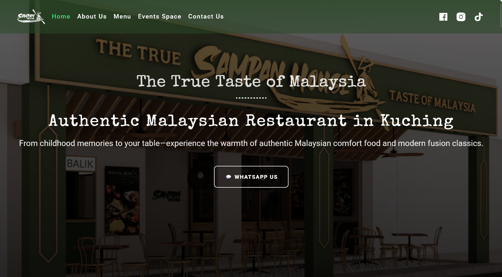

# My Portfolio


A restaurant business website developed for Sampan House, a restaurant based in Kuching, Sarawak.

The website provides customers with information about the restaurant, menu, events, and contact details through a responsive web interface.

Live Demo  
https://sampan-house.vercel.app

---

## Website Preview



---

## Project Overview

This website was developed as a junior web development project for Sampan House.

The main purpose of the website is to provide customers with an easy way to learn more about the restaurant and access important restaurant information online.

The website provides information about:

- Restaurant introduction
- Restaurant story
- Food menu
- Restaurant events
- Contact information
- Restaurant images

The project also includes a simple CMS setup that allows the restaurant menu PDF to be updated without directly modifying the website code.

---

## Key Features

- Restaurant homepage
- About Sampan House page
- Food menu page
- Restaurant event information
- Contact page
- Contact form with WhatsApp integration
- Responsive website layout
- Navigation bar
- Scroll-to-top functionality
- PDF menu display and download
- CMS-based menu management
- OAuth 2.0 authentication for CMS access
- Static image and media content

---

## Technologies Used

### Frontend

- Next.js
- React
- JavaScript
- HTML
- CSS
- Next.js App Router

### Content Management

- DECAP CMS
- GitHub
- OAuth 2.0

### Development Tools

- Visual Studio Code
- Git
- GitHub

### Deployment

- Vercel

---

## Project Structure

The project uses the Next.js App Router and separates pages, reusable components, static assets, and CMS configuration.

```
Sampan House/
│
├── app/
│   ├── about/
│   │   └── page.js
│   │
│   ├── contact/
│   │   └── page.js
│   │
│   ├── event/
│   │   └── page.js
│   │
│   ├── menu/
│   │   └── page.js
│   │
│   ├── layout.js
│   ├── page.js
│   └── sitemap.js
│
├── api/
│   ├── auth.js
│   └── callback.js
│
├── components/
│   ├── contact/
│   │   ├── ContactForm.css
│   │   └── ContactForm.js
│   ├── home/
│   │   ├── AboutSection.css
│   │   ├── AboutSection.js
│   │   ├── EventSection.js
│   │   ├── GoogleReview.css
│   │   ├── GoogleReview.js
│   │   ├── HeroSection.js
│   │   ├── LatestNews.css
│   │   ├── LatestNews.js
│   │   ├── MenuSection.css
│   │   └── MenuSection.js
│   ├── menu/
│   │   ├── MenuPDF.css
│   │   ├── MenuPDF.js
│   │   └── MenuPDFClient.js
│   └── shared/
│		 ├── ContactSection.css
│		 ├── ContactSection.js
│		 ├── Footer.css
│		 ├── Footer.js
│		 ├── Header.css
│		 ├── Header.js
│		 ├── ScrollToTop.css
│		 └──ScrollToTop.js
│
├── public/
│   ├── admin/
│   │   ├── config.yml
│   │   └── index.html
│   │
│   ├── img/
│   │   └── website images
│   │
│   └── menu/
│       ├── menu-config.md
│       └── menu.pdf
│
├── style.css
├── package.json
├── package-lock.json
├── vercel.json
└── .gitignore
```

The app folder contains the main Next.js pages and application layout. Reusable UI elements are organized inside the components folder, while the public folder contains static images, the menu PDF, and Decap CMS configuration.

---

## Development

The website was developed using Next.js and React and is designed to be deployed using Vercel.

To run the project locally, clone the repository and install the required packages.

1. Clone the Repository
   git clone https://github.com/valarie-lim/sampan.house
2. Open the Project Folder
   cd sampan.house
3. Install Dependencies
   npm install
4. Start the Development Server
   npm run dev

The website will then be available on the local development server at:
http://localhost:3000

---

## Build for Production

To create a production build:
npm run build

To start the production version:
npm start

---

## Responsive Design

The website is designed to work across different screen sizes, including:

- Desktop
- Laptop
- Tablet
- Mobile devices

Responsive styling helps provide a consistent and accessible user experience across different devices.

---

## Content Management

The website uses Decap CMS to provide a simple way for the restaurant to update the menu PDF.

The CMS is configured within the website and uses OAuth 2.0 authentication to provide authenticated access to the CMS.

This allows the client to manage the menu without needing to modify the website source code directly.

---

## What I Learned

Through this project, I gained practical experience in:

- Developing a website using Next.js
- Using React components
- Creating pages with the Next.js App Router
- Creating and organizing reusable components
- Working with JavaScript
- Designing responsive webpages using CSS
- Creating a contact form with WhatsApp integration
- Working with PDF files
- Integrating Decap CMS
- Configuring OAuth 2.0 authentication
- Managing content through a CMS
- Managing a project using Git and GitHub
- Deploying a website using Vercel

---

## Future Improvements

Some possible improvements for the website include:

- Improve mobile responsive design
- Improve animations and interactions
- Add more restaurant information
- Improve the menu browsing experience
- Add more event information
- Improve SEO and metadata
- Add an online food ordering system
- Add online table reservation functionality

---

## Author

Valarie Lim  
Diploma in Information Technology
